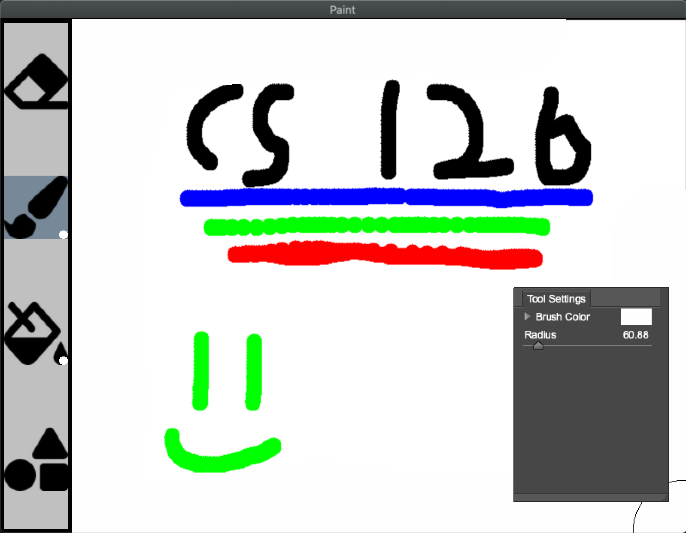

# Paint
This repository hosts the code for my CS126 final project. I choose to do a simple paint program that allows basic image editing.

Currently this program allows one to:
- Draw with a paint brush tool (configurable radius and color)
- Flood fill with a paint bucket tool (configurable color)
- Stamp shapes onto the canvas (star and heart, configurable size and color)
- Erase mistakes (configurable size)
- Load images from file
- Save images to file

# Build Instructions
To build this project, you must first install a local copy of the [Cinder C++ Library](https://libcinder.org/). 

After doing that, clone this repository within the my-projects folder. 
Then you should be able to build with cmake.
